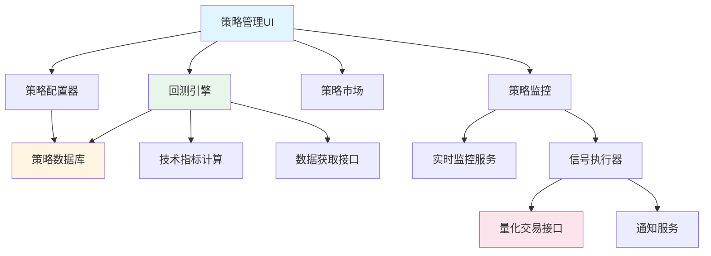

# 策略管理模块开发设计文档

## 1. 概述

### 1.1 模块定位

策略管理模块是股票分析系统的核心功能扩展，旨在为用户提供完整的量化交易策略生命周期管理能力。该模块将整合现有的数据获取、技术指标计算、AI分析等能力，构建一个从策略创建、回测验证、到实盘运行的完整闭环。

### 1.2 设计目标

- **用户友好性**：提供可视化界面，降低策略创建门槛，无需编程即可配置策略
- **灵活性**：支持多种策略类型（选股策略、交易策略），可自定义条件组合
- **可验证性**：提供历史数据回测功能，量化评估策略有效性
- **可扩展性**：策略配置采用结构化存储，易于后续功能扩展
- **模块独立性**：完全独立运行，不影响现有模块的数据获取和分析功能
- **零侵入原则**：使用独立的数据库、独立的UI入口、独立的数据获取通道

### 1.3 核心价值

- 将专业投资者的交易逻辑固化为可复用的策略
- 通过历史回测降低策略风险，提升决策科学性
- 实现从人工决策到系统化自动化交易的转变
- 积累和沉淀用户的投资经验和知识

### 1.4 模块隔离原则 ⚠️

**核心约束**：策略管理模块在开发和运行过程中，必须严格遵守以下隔离原则，确保不对现有系统造成任何影响。

#### 1.4.1 数据库隔离

**独立数据库文件**：
- 使用独立的数据库文件：`strategy_management.db`
- 不得修改或访问现有数据库：`stock_analysis.db`、`config.db`等
- 所有策略相关数据（策略配置、回测结果、信号记录）存储在独立数据库中

**数据库连接管理**：
- 在`strategy_db.py`中创建独立的数据库连接实例
- 使用独立的Peewee Database对象，避免影响其他模块的数据库连接池
- 数据库初始化在模块首次使用时自动执行，不在应用启动时强制初始化

#### 1.4.2 数据获取隔离

**只读访问现有接口**：
- 策略模块可以调用`unified_data_access.py`中的**只读方法**（如`get_daily_backtest_data()`）
- 不得修改`unified_data_access.py`的任何代码
- 不得修改`data_source_manager.py`的配置或状态

**独立的数据获取通道**：
- 如果需要特殊的数据获取逻辑，在策略模块内部单独实现
- 确保数据获取不会影响现有模块的API限流配额（使用独立的缓存机制）
- 不修改全局的Tushare/AKShare配置

#### 1.4.3 UI界面隔离

**独立的页面文件**：
- 创建独立的UI文件：`strategy_ui.py`或`pages/策略管理.py`
- 不修改现有UI文件（`app.py`、`pages/`目录下的其他文件）
- 使用Streamlit的多页面机制，自动注册为独立页面

**独立的Session State命名空间**：
- 所有策略相关的session state使用统一前缀：`strategy_mgmt_*`
- 例如：`st.session_state.strategy_mgmt_selected_strategy`
- 避免与现有功能的session state冲突

**不修改主程序导航**：
- 暂不修改`app.py`的侧边栏配置
- 策略管理页面作为独立页面存在于`pages/`目录，Streamlit自动识别
- 用户通过页面选择器访问策略管理功能

#### 1.4.4 依赖库隔离

**不添加新的系统依赖**：
- 仅使用项目现有的依赖库（pandas、numpy、plotly、streamlit、peewee等）
- 如果确实需要新依赖，必须在设计文档中明确说明，并评估对现有环境的影响
- 优先选择轻量级、纯Python实现的库

#### 1.4.5 配置文件隔离

**独立的配置管理**：
- 策略模块的配置存储在独立的JSON文件中：`strategy_config.json`
- 不修改`.env`文件或`config.py`
- 如需复用API密钥等全局配置，只读访问`config_manager`

#### 1.4.6 代码文件隔离

**独立的代码文件命名**：
- 所有策略管理相关文件使用统一前缀：`strategy_*`
- 例如：`strategy_db.py`、`strategy_backtest_engine.py`、`strategy_ui.py`
- 便于识别和管理，避免文件名冲突

**不修改现有代码文件**：
- 不得修改以下现有文件：
  - `unified_data_access.py`（只读调用）
  - `data_source_manager.py`（只读调用）
  - `app.py`（暂不集成导航）
  - `miniqmt_interface.py`（暂不集成自动交易）
  - 其他任何非`strategy_*`开头的文件

#### 1.4.7 功能集成时机

**分阶段集成策略**：

**第一阶段（当前）**：
- ✅ 完全独立开发和测试
- ✅ 使用独立数据库、独立UI
- ✅ 只读访问数据获取接口
- ✅ 不修改任何现有文件

**第二阶段（未来，需用户确认）**：
- ⏳ 将策略管理添加到主程序导航（修改`app.py`）
- ⏳ 与监控系统集成（策略信号触发监控提醒）
- ⏳ 与量化交易集成（策略信号自动下单）
- ⏳ 与AI分析集成（AI辅助策略优化）

**集成前提条件**：
- ✅ 策略模块已独立完成开发和充分测试
- ✅ 用户明确批准集成方案
- ✅ 提供集成前的完整回滚方案

#### 1.4.8 测试隔离

**独立的测试环境**：
- 测试文件命名：`test_strategy_*.py`
- 使用独立的测试数据库：`test_strategy.db`
- 测试不依赖现有模块的运行状态
- 测试数据不污染生产数据库

**验收标准**：
- ✅ 策略模块删除后，现有功能100%正常运行
- ✅ 策略模块运行时，现有功能的性能无明显下降（<5%）
- ✅ 数据库文件大小不影响现有数据库
- ✅ 不产生任何全局配置冲突

---

**重要性说明**：

上述隔离原则是策略管理模块开发的**最高优先级约束**，任何设计和实现都必须严格遵守。在整个开发过程中，如果遇到需要修改现有模块的情况，应优先寻找替代方案，而非直接修改现有代码。

这确保了：
1. 现有系统的稳定性和可靠性不受影响
2. 策略模块可以独立迭代和升级
3. 出现问题时可以快速回滚
4. 降低系统耦合度，提升可维护性

## 2. 当前开发进度分析

### 2.1 已完成模块

#### ✅ 策略数据库模块（strategy_db.py）

**完成度：90%**

**已实现功能**：

**数据模型设计**：
- ✅ Strategy表：完整的策略定义和配置存储
  - 基本信息字段：uuid、name、type、category、description等
  - 条件配置：entry_conditions、exit_conditions（JSON格式存储）
  - 指标配置：required_indicators、parameters（JSON格式）
  - AI辅助：logic_description（AI生成的策略解释）
  - 统计信息：total_backtests、avg_return、avg_win_rate、avg_max_drawdown
  - 时间戳：created_at、updated_at
  
- ✅ BacktestResult表：回测结果完整存储
  - 回测参数：stock_code、start_date、end_date、initial_capital
  - 收益指标：total_return、annual_return、final_capital
  - 风险指标：max_drawdown、sharpe_ratio
  - 交易统计：total_trades、win_trades、lose_trades、win_rate、profit_loss_ratio
  - 详细数据：period_returns、trade_details（JSON格式）
  
- ✅ StrategySignal表：交易信号记录
  - 信号基本信息：signal_date、signal_type（entry/exit）、signal_price
  - 上下文数据：indicators（当时指标值）、matched_rules（触发规则）
  - 关联关系：backtest、strategy外键

**数据库操作类**：
- ✅ StrategyDB类：完整CRUD操作
  - create_strategy()：创建新策略，支持JSON字段序列化
  - get_strategy()：获取策略详情，自动反序列化JSON
  - list_strategies()：支持按type/status/category筛选
  - update_strategy()：更新策略，自动处理JSON字段
  - delete_strategy()：级联删除策略及关联数据
  - _strategy_to_dict()：对象转字典，便于API返回
  
- ✅ BacktestDB类：回测结果管理
  - save_backtest_result()：保存回测结果
  - _update_strategy_stats()：自动更新策略统计指标

**数据库功能**：
- ✅ init_database()：自动创建表结构
- ✅ get_db()：数据库连接管理
- ✅ 索引优化：uuid、stock_code、(strategy, stock_code)复合索引
- ✅ 测试代码：包含完整的创建和查询测试

**待补充功能**（设计文档中规划但未实现）：
- ⏳ Strategy表需新增字段：tags、is_public、clone_count、like_count、risk_level
- ⏳ 新增StrategyRun表：记录策略实盘运行状态
- ⏳ 新增StrategyNotification表：通知记录
- ⏳ BacktestDB需补充查询方法：get_backtest_results()、get_strategy_performance()等

---

#### ✅ 技术指标计算模块（strategy_indicators.py）

**完成度：100%**

**已实现功能**：

**核心函数**：
- ✅ calculate_all_indicators()：一站式计算所有常用指标
  - 移动均线：MA5、MA10、MA20、MA60
  - 成交量均线：VOL_MA5、VOL_MA10
  - MACD指标：MACD、MACD_SIGNAL、MACD_HIST
  - RSI指标：RSI（14周期）
  - 布林带：BOLL_UPPER、BOLL_MIDDLE、BOLL_LOWER
  - KDJ指标：KDJ_K、KDJ_D、KDJ_J
  - NaN值处理：自动填充和回填

**专项计算函数**：
- ✅ calculate_ma()：自定义周期均线
- ✅ calculate_ema()：指数移动平均
- ✅ calculate_macd()：自定义参数MACD
- ✅ calculate_rsi()：自定义周期RSI
- ✅ calculate_bollinger_bands()：自定义参数布林带
- ✅ calculate_kdj()：自定义周期KDJ

**代码质量**：
- ✅ 完整的类型注解
- ✅ 详细的函数文档
- ✅ 边界情况处理（空数据、除零保护）
- ✅ 测试代码覆盖

**优势**：
- ✅ 数据不可变：使用copy()避免修改原数据
- ✅ 列名标准化：自动转小写
- ✅ 灵活性：支持自定义参数
- ✅ 稳定性：fillna()处理边界情况

---

#### ✅ 数据获取支持（unified_data_access.py）

**完成度：100%**

**已实现功能**：
- ✅ get_daily_backtest_data()：回测专用日线数据获取
  - 支持Tushare优先，AKShare兜底的双数据源
  - 支持前复权/后复权/不复权
  - 标准化数据格式：date、open、high、low、close、volume
  - 完整的异常处理和日志记录
  - 数据质量校验：确保必需列存在

**集成价值**：
- ✅ 为回测引擎提供了可靠的历史数据接口
- ✅ **只读调用**，无需修改现有数据获取逻辑
- ✅ 复用了项目的数据源管理机制，但不影响其他模块的数据获取

---

### 2.2 未开始模块

#### ❌ 回测引擎（strategy_backtest_engine.py）- 未创建

**缺失功能**：
- 条件评估引擎：解析JSON格式的规则配置
- 回测主流程：遍历历史数据，模拟交易
- 信号生成逻辑：根据条件生成买入/卖出信号
- 交易模拟器：维护虚拟持仓和资金账户
- 成本计算：手续费、印花税、滑点
- 指标计算：收益率、回撤、夏普比率等
- 结果持久化：调用BacktestDB保存结果

**开发难点**：
- 规则引擎的递归解析（支持嵌套条件）
- 跨越运算符实现（向上突破、向下突破）
- 性能优化（大量历史数据计算）

---

#### ❌ 策略监控服务（strategy_monitor_service.py）- 未创建

**缺失功能**：
- 定时调度机制
- 实时数据获取
- 信号检测逻辑（复用回测引擎的条件评估）
- 信号质量评分
- 通知推送集成
- 自动交易执行
- 风控检查
- 状态管理

**开发难点**：
- 多策略并行监控的性能优化
- 信号去重和防重复推送
- 与MiniQMT的稳定集成

---

#### ❌ 策略UI界面（strategy_ui.py）- 未创建

**缺失功能**：
- 策略列表展示
- 策略创建/编辑界面（可视化条件构建器）
- 回测界面（参数配置、结果可视化）
- 策略市场（预置模板浏览）
- 实盘监控界面（运行状态、信号列表）
- 策略分析界面（绩效对比）

**开发难点**：
- 可视化条件构建器的交互设计
- 回测结果的图表可视化（资金曲线、交易标记）
- 实时状态更新机制

---

#### ❌ 主程序集成（app.py）- 未集成

**缺失集成**：
- 策略管理模块未添加到侧边栏导航
- 未创建策略管理的路由和页面入口
- 未在主界面添加快捷访问入口

---

### 2.3 开发进度总结

**整体完成度：约25%**

```
进度可视化：
[████████░░░░░░░░░░░░░░░░░░░░░░░░░░] 25%

已完成：
✅ 数据库层（90%）      [█████████░]
✅ 技术指标计算（100%）  [██████████]
✅ 数据获取支持（100%）  [██████████]

未开始：
❌ 回测引擎（0%）        [░░░░░░░░░░]
❌ 监控服务（0%）        [░░░░░░░░░░]
❌ UI界面（0%）          [░░░░░░░░░░]
❌ 主程序集成（0%）      [░░░░░░░░░░]
```

**按功能模块统计**：

| 模块 | 状态 | 完成度 | 文件 | 说明 |
|------|------|--------|------|------|
| 数据库层 | ✅ 部分完成 | 90% | strategy_db.py | 核心表和CRUD完成，需扩展字段和表 |
| 技术指标 | ✅ 完成 | 100% | strategy_indicators.py | 所有常用指标已实现 |
| 数据获取 | ✅ 完成 | 100% | unified_data_access.py | 回测数据接口已就绪 |
| 回测引擎 | ❌ 未开始 | 0% | - | 核心功能，优先级最高 |
| 策略市场 | ❌ 未开始 | 0% | - | 需预置策略模板数据 |
| 监控服务 | ❌ 未开始 | 0% | - | 依赖回测引擎的条件评估 |
| 自动交易 | ⏳ 可复用 | - | miniqmt_interface.py | 已有接口，可直接集成 |
| UI界面 | ❌ 未开始 | 0% | - | 工作量较大 |
| 主程序集成 | ❌ 未开始 | 0% | app.py | 添加导航和路由 |

---

### 2.4 后续开发建议

**优先级排序**：

**P0 - 最高优先级（核心功能MVP）**：
1. 🔴 **回测引擎开发**（预计2周）
   - 实现条件评估引擎（支持AND/OR逻辑、嵌套条件）
   - 实现回测主流程（信号生成、交易模拟）
   - 实现核心指标计算（收益率、回撤、胜率等）
   - 完成数据库集成和结果保存
   - 编写单元测试验证准确性

2. 🔴 **基础UI界面**（预计1.5周）
   - 策略列表页面（查看、筛选、删除）
   - 简单的策略创建表单（文本输入条件，暂不做可视化构建器）
   - 回测界面（参数输入、启动回测、查看核心指标）
   - **注意**：创建独立页面文件 `pages/策略管理.py`，不修改 `app.py`

**P1 - 高优先级（完善回测体验）**：
3. 🟡 **回测结果可视化**（预计1周）
   - 资金曲线图（Plotly）
   - 回撤曲线图
   - 交易明细表格
   - PDF报告生成（复用现有 pdf_generator）

4. 🟡 **策略市场**（预计1周）
   - 创建5-7个预置策略模板
   - 策略浏览和克隆功能
   - 模板详情页面

**P2 - 中优先级（实盘功能，暂缓）**：
5. 🟢 **策略监控服务**（预计2周）
   - 定时调度框架
   - 信号检测逻辑（复用回测引擎）
   - **暂不集成**现有通知推送系统
   - 监控状态管理

6. 🟢 **自动交易执行**（预计1.5周）
   - **暂不集成** MiniQMT
   - 仓位管理策略设计
   - 风控机制设计
   - 交易日志

**P3 - 低优先级（体验优化）**：
7. 🔵 **可视化条件构建器**（预计1周）
   - 拖拽式条件配置
   - AI辅助功能（策略解释、风险评估）

8. 🔵 **策略分析与优化**（预计1周）
   - 策略绩效对比
   - 参数敏感性分析
   - 优化建议

**总预计时间**：P0+P1约5.5周（独立开发和测试），全部完成约10周

---

### 2.5 快速启动路径

**如果要快速看到效果，建议按以下步骤开发**：

**第1周：最小可用回测**
- Day 1-2：实现简单规则引擎（仅支持单条件，如 CLOSE > MA20）
- Day 3-4：实现回测主流程（固定止盈止损）
- Day 5：编写测试，验证准确性

**第2周：基础UI**
- Day 1-2：策略列表 + 手动输入条件的创建表单
- Day 3-4：回测界面 + 结果展示（纯表格，暂无图表）
- Day 5：创建独立页面 `pages/策略管理.py`，端到端测试（**不修改 app.py**）

**第3周：可视化优化**
- Day 1-3：添加资金曲线图、回撤图
- Day 4-5：添加交易标记K线图

**里程碑验证**：
- ✅ 用户能通过独立UI页面创建简单策略
- ✅ 能对单只股票执行回测
- ✅ 能看到核心指标和曲线图
- ✅ 能保存策略和查看历史回测
- ✅ **验证现有功能不受影响**（删除策略模块后系统正常运行）

达到此状态后，策略管理模块即可进入Alpha测试阶段。

---

## 3. 功能架构设计

### 3.1 模块组成

策略管理模块由以下核心组件构成：



---

**置信度：High（高）**

**信心依据**：
1. ✅ **基础已就绪**：数据库、指标计算、数据获取已完成90%以上
2. ✅ **技术成熟**：使用项目已验证的技术栈（Streamlit、peewee、plotly等）
3. ✅ **参考充分**：可参考项目中多个成熟模块的实现模式
4. ✅ **风险可控**：已识别主要技术难点并提供应对方案
5. ✅ **路径清晰**：提供分阶段实施计划和快速启动路径

**建议下一步行动**：
1. 优先开发回测引擎的简单规则引擎（支持基本比较运算）
2. 实现回测主流程并验证准确性
3. 开发基础UI实现端到端功能演示
4. 逐步完善可视化和高级功能

设计文档已完成，现有代码已为后续开发奠定了坚实基础。建议从P0优先级的回测引擎开始实施开发。

---

## 4. 数据库设计规范

### 4.1 数据库文件管理

**独立数据库文件**：
- 数据库文件名：`strategy_management.db`
- 存储位置：项目根目录
- 与现有数据库完全隔离：不访问 `stock_analysis.db`、`config.db` 等文件

**数据库连接示例**：

策略模块使用独立的数据库连接对象，在 `strategy_db.py` 中定义：

```
# 独立的数据库连接
STRATEGY_DB_PATH = 'strategy_management.db'
strategy_db = SqliteDatabase(STRATEGY_DB_PATH)

# 所有策略相关的Model都使用这个数据库
class BaseModel(Model):
    class Meta:
        database = strategy_db
```

### 4.2 数据表设计

#### 4.2.1 Strategy（策略表）

**用途**：存储策略的定义、配置和统计信息

**字段设计**：

| 字段名 | 数据类型 | 约束 | 说明 |
|--------|---------|------|------|
| id | INTEGER | 主键，自增 | 策略ID |
| uuid | VARCHAR(36) | 唯一索引，非空 | 策略全局唯一标识 |
| name | VARCHAR(100) | 非空 | 策略名称 |
| type | VARCHAR(20) | 非空 | 策略类型：selection（选股）/trading（交易） |
| category | VARCHAR(50) | 可空 | 策略分类：趋势追踪/均值回归/突破/等 |
| description | TEXT | 非空 | 用户输入的策略描述 |
| logic_description | TEXT | 非空 | AI生成的策略逻辑浅显解释 |
| entry_conditions | TEXT | 非空 | 入场条件（JSON格式） |
| exit_conditions | TEXT | 可空 | 出场条件（JSON格式，仅交易策略需要） |
| required_indicators | TEXT | 非空 | 所需技术指标列表（JSON数组） |
| parameters | TEXT | 非空 | 策略参数配置（JSON对象） |
| status | VARCHAR(20) | 非空，默认'active' | 策略状态：active/inactive/archived |
| total_backtests | INTEGER | 默认0 | 累计回测次数 |
| avg_return | REAL | 可空 | 平均收益率 |
| avg_win_rate | REAL | 可空 | 平均胜率 |
| avg_max_drawdown | REAL | 可空 | 平均最大回撤 |
| tags | TEXT | 可空 | 标签（JSON数组，用于分类和搜索） |
| is_public | BOOLEAN | 默认False | 是否公开到策略市场 |
| created_at | DATETIME | 非空 | 创建时间 |
| updated_at | DATETIME | 非空 | 更新时间 |

**索引**：
- uuid：唯一索引
- type：普通索引（按类型筛选）
- status：普通索引（按状态筛选）

**JSON字段格式示例**：

```
# entry_conditions（入场条件）
{
  "operator": "AND",
  "conditions": [
    {
      "indicator": "CLOSE",
      "operator": ">",
      "value": "MA20"
    },
    {
      "indicator": "RSI",
      "operator": "<",
      "value": 30
    }
  ]
}

# required_indicators
["MA20", "RSI", "MACD"]

# parameters
{
  "stop_loss_pct": 0.05,
  "take_profit_pct": 0.15,
  "position_size": 0.3
}
```

#### 4.2.2 BacktestResult（回测结果表）

**用途**：存储每次回测的详细结果

**字段设计**：

| 字段名 | 数据类型 | 约束 | 说明 |
|--------|---------|------|------|
| id | INTEGER | 主键，自增 | 回测结果ID |
| strategy_id | INTEGER | 外键，非空 | 关联Strategy.id |
| stock_code | VARCHAR(20) | 非空，索引 | 股票代码 |
| stock_name | VARCHAR(50) | 可空 | 股票名称 |
| start_date | DATE | 非空 | 回测开始日期 |
| end_date | DATE | 非空 | 回测结束日期 |
| initial_capital | REAL | 非空 | 初始资金 |
| final_capital | REAL | 非空 | 最终资金 |
| total_return | REAL | 非空 | 总收益率 |
| annual_return | REAL | 可空 | 年化收益率 |
| max_drawdown | REAL | 可空 | 最大回撤 |
| sharpe_ratio | REAL | 可空 | 夏普比率 |
| total_trades | INTEGER | 非空 | 总交易次数 |
| win_trades | INTEGER | 非空 | 盈利交易次数 |
| lose_trades | INTEGER | 非空 | 亏损交易次数 |
| win_rate | REAL | 可空 | 胜率 |
| profit_loss_ratio | REAL | 可空 | 盈亏比 |
| period_returns | TEXT | 可空 | 分期收益（JSON数组，用于绘制曲线） |
| trade_details | TEXT | 可空 | 交易明细（JSON数组） |
| created_at | DATETIME | 非空 | 回测执行时间 |

**索引**：
- strategy_id：普通索引
- stock_code：普通索引
- (strategy_id, stock_code)：复合索引

**JSON字段格式示例**：

```
# period_returns（每日资金曲线）
[
  {"date": "2024-01-01", "capital": 100000, "return": 0.0},
  {"date": "2024-01-02", "capital": 101200, "return": 0.012},
  ...
]

# trade_details（交易明细）
[
  {
    "entry_date": "2024-01-05",
    "entry_price": 12.50,
    "exit_date": "2024-01-10",
    "exit_price": 13.20,
    "shares": 1000,
    "profit": 700,
    "return": 0.056,
    "type": "long"
  },
  ...
]
```

#### 4.2.3 StrategySignal（策略信号表）

**用途**：记录回测和实盘运行过程中产生的所有信号

**字段设计**：

| 字段名 | 数据类型 | 约束 | 说明 |
|--------|---------|------|------|
| id | INTEGER | 主键，自增 | 信号ID |
| strategy_id | INTEGER | 外键，非空 | 关联Strategy.id |
| backtest_id | INTEGER | 外键，可空 | 关联BacktestResult.id（回测信号） |
| stock_code | VARCHAR(20) | 非空，索引 | 股票代码 |
| signal_date | DATE | 非空，索引 | 信号日期 |
| signal_type | VARCHAR(10) | 非空 | 信号类型：entry（入场）/exit（出场） |
| signal_price | REAL | 非空 | 信号价格 |
| indicators | TEXT | 可空 | 当时的技术指标值（JSON对象） |
| matched_rules | TEXT | 可空 | 触发的规则（JSON数组） |
| is_executed | BOOLEAN | 默认False | 是否已执行（实盘用） |
| created_at | DATETIME | 非空 | 信号生成时间 |

**索引**：
- strategy_id：普通索引
- stock_code：普通索引
- signal_date：普通索引

**JSON字段格式示例**：

```
# indicators（当时指标值）
{
  "CLOSE": 12.50,
  "MA20": 12.00,
  "RSI": 28.5,
  "MACD": 0.15
}

# matched_rules（触发的规则）
[
  "CLOSE > MA20",
  "RSI < 30"
]
```

### 4.3 数据库操作类设计

#### 4.3.1 StrategyDB类

**职责**：策略的CRUD操作

**核心方法**：

| 方法名 | 参数 | 返回值 | 说明 |
|--------|------|--------|------|
| create_strategy | strategy_data: dict | dict | 创建新策略，返回包含strategy_id的字典 |
| get_strategy | strategy_id: int | dict | 获取策略详情，自动反序列化JSON字段 |
| list_strategies | type, status, category, limit, offset | list[dict] | 查询策略列表，支持筛选和分页 |
| update_strategy | strategy_id: int, updates: dict | dict | 更新策略，自动处理JSON字段序列化 |
| delete_strategy | strategy_id: int | dict | 删除策略，级联删除关联的回测和信号 |
| search_strategies | keyword: str | list[dict] | 按名称、描述、标签搜索策略 |

**实现要点**：
- 所有返回的dict中，JSON字段已反序列化为Python对象
- 删除操作需要级联删除关联的BacktestResult和StrategySignal
- 更新操作自动更新updated_at字段

#### 4.3.2 BacktestDB类

**职责**：回测结果的存储和查询

**核心方法**：

| 方法名 | 参数 | 返回值 | 说明 |
|--------|------|--------|------|
| save_backtest_result | backtest_data: dict | dict | 保存回测结果，自动更新策略统计 |
| get_backtest_result | backtest_id: int | dict | 获取回测详情 |
| list_backtest_results | strategy_id, stock_code, limit | list[dict] | 查询回测历史 |
| get_strategy_performance | strategy_id: int | dict | 获取策略的整体表现统计 |
| compare_backtests | backtest_ids: list[int] | dict | 对比多个回测结果 |

**实现要点**：
- save_backtest_result方法需要调用_update_strategy_stats更新策略统计
- period_returns和trade_details需要正确序列化为JSON

#### 4.3.3 SignalDB类（待实现）

**职责**：信号的存储和查询

**核心方法**：

| 方法名 | 参数 | 返回值 | 说明 |
|--------|------|--------|------|
| save_signal | signal_data: dict | dict | 保存单个信号 |
| batch_save_signals | signals: list[dict] | dict | 批量保存信号（回测用） |
| get_recent_signals | strategy_id, days | list[dict] | 获取最近N天的信号 |
| get_unexecuted_signals | strategy_id | list[dict] | 获取未执行的信号（实盘用） |
| mark_as_executed | signal_id: int | dict | 标记信号为已执行 |

### 4.4 数据库初始化流程

**初始化时机**：
- 策略模块首次使用时自动初始化
- 不在应用启动时强制初始化

**初始化代码位置**：
- 在 `strategy_db.py` 文件末尾提供 `init_database()` 函数
- 在各个操作类的构造函数中调用

**初始化流程**：

```
自然语言描述：

1. 检查数据库文件是否存在
2. 如果不存在，创建数据库连接
3. 创建所有表（Strategy、BacktestResult、StrategySignal）
4. 创建索引
5. 记录日志：策略管理数据库初始化完成
```

### 4.5 数据库隔离验证

**验证方法**：

1. **独立性验证**：
   - 删除 `strategy_management.db` 文件
   - 运行现有功能，确认100%正常
   - 运行策略模块，确认自动创建数据库

2. **性能验证**：
   - 策略模块运行时，监控现有功能的响应时间
   - 确保性能下降小于5%

3. **数据隔离验证**：
   - 使用数据库工具检查 `strategy_management.db` 和 `stock_analysis.db`
   - 确认没有跨库访问或依赖

---

## 5. 核心功能设计

### 5.1 回测引擎设计

#### 5.1.1 核心流程

**回测引擎的职责**：
- 根据策略配置，在历史数据上模拟交易
- 生成交易信号
- 管理虚拟账户和持仓
- 计算绩效指标

**主流程描述**：

```
输入：
  - 策略配置（entry_conditions、exit_conditions、parameters）
  - 股票代码
  - 回测时间范围
  - 初始资金

步骤：
  1. 获取历史数据（调用 unified_data_access.get_daily_backtest_data()）
  2. 计算所需技术指标（调用 strategy_indicators.calculate_all_indicators()）
  3. 初始化虚拟账户：
     - 可用资金 = 初始资金
     - 持仓 = 空
     - 交易记录 = []
  4. 按日期顺序遍历数据：
     - 如果当前无持仓：
       - 评估入场条件
       - 如果满足条件：生成买入信号，执行买入
     - 如果当前有持仓：
       - 评估出场条件
       - 如果满足条件：生成卖出信号，执行卖出
     - 记录当日账户状态（资金、持仓、收益率）
  5. 计算绩效指标：
     - 总收益率
     - 年化收益率
     - 最大回撤
     - 夏普比率
     - 胜率、盈亏比
  6. 保存结果到数据库：
     - 保存BacktestResult
     - 批量保存StrategySignal
     - 更新Strategy统计信息

输出：
  - 回测结果对象（包含所有指标和交易明细）
```

#### 5.1.2 条件评估引擎

**职责**：解析和评估策略条件

**支持的运算符**：

| 运算符 | 说明 | 示例 |
|--------|------|------|
| > | 大于 | CLOSE > MA20 |
| < | 小于 | RSI < 30 |
| >= | 大于等于 | MACD >= 0 |
| <= | 小于等于 | KDJ_K <= 20 |
| == | 等于 | VOLUME == VOL_MA5 |
| cross_above | 向上突破 | CLOSE cross_above MA20 |
| cross_below | 向下突破 | MACD cross_below 0 |

**支持的逻辑运算符**：
- AND：所有条件都满足
- OR：任一条件满足

**条件评估算法**：

```
自然语言描述：

函数 evaluate_condition(condition, current_data, previous_data):
  如果 condition 包含 "operator" 字段：
    # 复合条件
    如果 operator == "AND":
      对所有子条件递归评估，返回全部为True
    如果 operator == "OR":
      对所有子条件递归评估，返回任一为True
  否则：
    # 简单条件
    indicator_value = 从 current_data 获取指标值
    
    如果 operator 是 "cross_above" 或 "cross_below":
      需要使用 previous_data 判断跨越
      cross_above: previous <= target and current > target
      cross_below: previous >= target and current < target
    否则：
      使用标准比较运算符
    
    返回比较结果
```

**示例条件结构**：

```
复杂条件示例（MA金叉且RSI超卖）：
{
  "operator": "AND",
  "conditions": [
    {
      "indicator": "MA5",
      "operator": "cross_above",
      "value": "MA20"
    },
    {
      "indicator": "RSI",
      "operator": "<",
      "value": 30
    }
  ]
}
```

#### 5.1.3 交易模拟器

**职责**：模拟真实交易的执行和账户管理

**核心逻辑**：

```
自然语言描述：

类 VirtualAccount:
  属性：
    - cash：可用资金
    - position：当前持仓 {stock_code, shares, cost_price}
    - trade_history：交易历史列表
  
  方法 buy(stock_code, price, date):
    根据 position_size 参数计算买入金额
    可买入股数 = (cash * position_size) / price / 100（向下取整到100股）
    如果可买入股数 > 0:
      成本 = 股数 * 价格 * (1 + 手续费率)
      cash -= 成本
      position = {stock_code, shares, cost_price: price}
      记录交易：{type: 'buy', date, price, shares, cost}
      返回成功
    否则：
      返回失败（资金不足）
  
  方法 sell(price, date):
    如果有持仓:
      收入 = 持仓股数 * 价格 * (1 - 手续费率 - 印花税率)
      cash += 收入
      profit = 收入 - (持仓股数 * 持仓成本价 * (1 + 手续费率))
      记录交易：{type: 'sell', date, price, shares, profit, return}
      position = None
      返回成功
    否则：
      返回失败（无持仓）
  
  方法 get_current_value(current_price):
    如果有持仓:
      持仓市值 = 持仓股数 * current_price
      总资产 = cash + 持仓市值
    否则:
      总资产 = cash
    返回总资产
```

**交易成本配置**：

| 费用项 | 费率 | 说明 |
|--------|------|------|
| 手续费 | 0.0003 | 买卖双向收取 |
| 印花税 | 0.001 | 仅卖出时收取 |
| 最低手续费 | 5元 | 单笔不足5元按5元收取 |

#### 5.1.4 绩效指标计算

**总收益率**：
```
total_return = (final_capital - initial_capital) / initial_capital
```

**年化收益率**：
```
days = 回测天数
years = days / 252（交易日）
annual_return = (1 + total_return) ^ (1 / years) - 1
```

**最大回撤**：
```
对于每日资金序列：
  peak = 历史最高资金
  drawdown = (current - peak) / peak
  max_drawdown = min(所有drawdown)
```

**夏普比率**：
```
日收益率序列 = 每日收益率列表
avg_return = 平均日收益率
std_return = 日收益率标准差
sharpe_ratio = (avg_return * 252) / (std_return * sqrt(252))
假设无风险利率为0
```

**胜率**：
```
win_rate = win_trades / total_trades
```

**盈亏比**：
```
avg_win = 平均盈利交易的收益
avg_loss = 平均亏损交易的亏损（绝对值）
profit_loss_ratio = avg_win / avg_loss
```

### 5.2 策略UI设计

#### 5.2.1 页面结构

**文件名**：`pages/策略管理.py`

**页面布局**：

```
顶部标题：策略管理系统

标签页（Tabs）：
  - 我的策略
  - 创建策略
  - 回测中心
  - 策略市场（预留）

【我的策略】标签页：
  - 筛选器：类型、状态、分类
  - 策略卡片列表：
    - 策略名称
    - 策略类型
    - 平均收益率
    - 回测次数
    - 操作按钮：查看、编辑、删除、回测

【创建策略】标签页：
  - 基本信息：名称、类型、分类、描述
  - 入场条件：
    - 文本输入框（JSON格式）
    - 预览区域（解析后的条件树）
  - 出场条件（仅交易策略）：
    - 文本输入框（JSON格式）
  - 参数配置：
    - 止损比例
    - 止盈比例
    - 仓位大小
  - 保存按钮

【回测中心】标签页：
  - 策略选择器
  - 回测参数：
    - 股票代码
    - 开始日期、结束日期
    - 初始资金
  - 启动回测按钮
  - 回测结果展示区：
    - 核心指标卡片（收益率、回撤、胜率等）
    - 资金曲线图（Plotly）
    - 交易明细表格
```

#### 5.2.2 Session State管理

**命名约定**：所有session state使用前缀 `strategy_mgmt_`

**关键状态变量**：

| 变量名 | 类型 | 用途 |
|--------|------|------|
| strategy_mgmt_selected_strategy | int | 当前选中的策略ID |
| strategy_mgmt_backtest_running | bool | 回测是否正在运行 |
| strategy_mgmt_backtest_result | dict | 最新的回测结果 |
| strategy_mgmt_filter_type | str | 策略列表筛选类型 |
| strategy_mgmt_filter_status | str | 策略列表筛选状态 |

#### 5.2.3 UI交互流程

**创建策略流程**：
```
1. 用户填写表单
2. 点击保存按钮
3. 前端验证：
   - 必填字段检查
   - JSON格式验证
4. 调用 StrategyDB.create_strategy()
5. 显示成功消息
6. 刷新策略列表
```

**执行回测流程**：
```
1. 用户选择策略
2. 输入回测参数（股票代码、时间范围、初始资金）
3. 点击启动回测按钮
4. 显示进度提示
5. 调用回测引擎执行回测
6. 回测完成后：
   - 保存结果到数据库
   - 在页面展示结果
   - 绘制资金曲线图
```

**删除策略流程**：
```
1. 用户点击删除按钮
2. 显示确认对话框
3. 用户确认后：
   - 调用 StrategyDB.delete_strategy()
   - 级联删除关联的回测和信号
4. 显示成功消息
5. 刷新策略列表
```

### 5.3 预置策略模板设计

**模板数量**：5-7个常见策略

**模板示例**：

**1. 均线金叉策略**
```
名称：均线金叉策略（MA5上穿MA20）
类型：trading
分类：趋势追踪
描述：当5日均线上穿20日均线时买入，下穿时卖出

入场条件：
{
  "indicator": "MA5",
  "operator": "cross_above",
  "value": "MA20"
}

出场条件：
{
  "indicator": "MA5",
  "operator": "cross_below",
  "value": "MA20"
}

参数：
{
  "stop_loss_pct": 0.05,
  "take_profit_pct": 0.15,
  "position_size": 0.5
}
```

**2. RSI超卖策略**
```
名称：RSI超卖反弹策略
类型：trading
分类：均值回归
描述：RSI低于30时买入，高于70时卖出

入场条件：
{
  "operator": "AND",
  "conditions": [
    {
      "indicator": "RSI",
      "operator": "<",
      "value": 30
    },
    {
      "indicator": "CLOSE",
      "operator": ">",
      "value": "MA20"
    }
  ]
}

出场条件：
{
  "indicator": "RSI",
  "operator": ">",
  "value": 70
}

参数：
{
  "stop_loss_pct": 0.03,
  "take_profit_pct": 0.10,
  "position_size": 0.3
}
```

**3. 布林带突破策略**
```
名称：布林带下轨反弹策略
类型：trading
分类：突破
描述：价格触及布林带下轨时买入，触及上轨时卖出

入场条件：
{
  "indicator": "CLOSE",
  "operator": "<",
  "value": "BOLL_LOWER"
}

出场条件：
{
  "indicator": "CLOSE",
  "operator": ">",
  "value": "BOLL_UPPER"
}

参数：
{
  "stop_loss_pct": 0.05,
  "take_profit_pct": 0.15,
  "position_size": 0.4
}
```

**4. MACD金叉策略**
```
名称：MACD金叉策略
类型：trading
分类：趋势追踪
描述：MACD上穿信号线时买入，下穿时卖出

入场条件：
{
  "indicator": "MACD",
  "operator": "cross_above",
  "value": "MACD_SIGNAL"
}

出场条件：
{
  "indicator": "MACD",
  "operator": "cross_below",
  "value": "MACD_SIGNAL"
}

参数：
{
  "stop_loss_pct": 0.05,
  "take_profit_pct": 0.12,
  "position_size": 0.5
}
```

**5. 多指标确认策略**
```
名称：多指标确认买入策略
类型：selection
分类：综合
描述：价格突破MA20，RSI超卖，MACD向上

入场条件：
{
  "operator": "AND",
  "conditions": [
    {
      "indicator": "CLOSE",
      "operator": ">",
      "value": "MA20"
    },
    {
      "indicator": "RSI",
      "operator": "<",
      "value": 40
    },
    {
      "indicator": "MACD_HIST",
      "operator": ">",
      "value": 0
    }
  ]
}

参数：
{
  "position_size": 0.3
}
```

---

## 6. 实现规范

### 6.1 代码文件组织

**文件清单**：

| 文件名 | 职责 | 优先级 |
|--------|------|--------|
| strategy_db.py | 数据库模型和CRUD操作 | ✅ 已完成 |
| strategy_indicators.py | 技术指标计算 | ✅ 已完成 |
| strategy_backtest_engine.py | 回测引擎核心逻辑 | 🔴 P0 |
| strategy_condition_evaluator.py | 条件评估引擎 | 🔴 P0 |
| strategy_virtual_account.py | 虚拟账户和交易模拟 | 🔴 P0 |
| strategy_performance_calculator.py | 绩效指标计算 | 🔴 P0 |
| pages/策略管理.py | Streamlit UI | 🔴 P0 |
| strategy_templates.py | 预置策略模板数据 | 🟡 P1 |
| strategy_monitor_service.py | 实盘监控服务 | 🟢 P2 |
| test_strategy_backtest.py | 回测引擎单元测试 | 🔴 P0 |
| test_strategy_condition.py | 条件评估单元测试 | 🔴 P0 |

**导入规范**：

```
策略模块内部导入：
  from strategy_db import StrategyDB, BacktestDB
  from strategy_indicators import calculate_all_indicators

只读访问现有模块：
  from unified_data_access import UnifiedDataAccess
  （仅调用 get_daily_backtest_data() 方法）

不允许的导入：
  禁止导入和修改：
    - app.py
    - miniqmt_interface.py（暂时）
    - smart_monitor_*.py（暂时）
    - portfolio_*.py
```

### 6.2 错误处理规范

**数据获取错误**：
```
场景：调用 get_daily_backtest_data() 失败
处理：
  - 记录日志：股票代码、时间范围、错误信息
  - 向用户显示友好提示："无法获取数据，请检查股票代码或网络连接"
  - 不影响其他策略的回测
```

**条件评估错误**：
```
场景：策略条件配置错误（如指标名不存在）
处理：
  - 记录日志：策略ID、错误条件、错误原因
  - 向用户显示："策略条件配置错误：指标 XYZ 不存在"
  - 中止当前回测，不保存结果
```

**数据库操作错误**：
```
场景：保存回测结果失败
处理：
  - 记录日志：完整的异常堆栈
  - 向用户显示："保存失败，请稍后重试"
  - 保留回测结果在内存中，允许用户重新保存
```

### 6.3 日志规范

**日志级别**：
- INFO：正常操作（策略创建、回测启动、回测完成）
- WARNING：非致命问题（数据缺失、指标计算异常值）
- ERROR：操作失败（数据获取失败、数据库错误）

**日志格式**：
```
[时间] [级别] [模块] - 消息

示例：
[2024-01-15 10:30:25] [INFO] [strategy_backtest] - 开始回测: 策略ID=5, 股票=000001, 时间范围=2023-01-01至2024-01-01
[2024-01-15 10:30:30] [INFO] [strategy_backtest] - 回测完成: 收益率=15.2%, 交易次数=8
[2024-01-15 10:31:00] [ERROR] [strategy_backtest] - 数据获取失败: 股票=999999, 错误=股票代码不存在
```

**日志文件**：
- 文件名：`strategy_management.log`
- 位置：项目根目录
- 与现有日志文件分离

### 6.4 测试规范

**单元测试覆盖范围**：

| 测试文件 | 测试对象 | 关键测试用例 |
|----------|----------|-------------|
| test_strategy_db.py | 数据库操作 | ✅ 已有测试 |
| test_strategy_condition.py | 条件评估 | 简单条件、复合条件、跨越运算符 |
| test_strategy_account.py | 虚拟账户 | 买入、卖出、手续费计算 |
| test_strategy_backtest.py | 回测引擎 | 完整回测流程、指标计算准确性 |

**测试数据**：
- 使用固定的历史数据CSV文件（避免依赖实时数据源）
- 测试数据文件：`test_data/sample_stock_data.csv`

**测试数据库**：
- 使用独立的测试数据库：`test_strategy.db`
- 每次测试前清空，测试后删除

### 6.5 性能优化建议

**数据处理优化**：
- 使用 pandas 向量化操作，避免循环
- 技术指标计算一次性完成，复用结果

**数据库优化**：
- 批量保存信号（使用 batch_save_signals）
- 使用索引加速查询
- 避免在循环中查询数据库

**UI响应优化**：
- 回测使用异步执行（st.spinner）
- 大数据量图表使用采样显示

---

## 7. 风险与限制

### 7.1 技术风险

**风险1：回测准确性**
- 描述：回测结果可能与实盘存在偏差
- 原因：数据质量、滑点、流动性、停牌等因素
- 缓解措施：
  - 在UI明确提示"历史表现不代表未来收益"
  - 预留滑点参数（未来版本）
  - 提供保守估计模式

**风险2：数据依赖**
- 描述：依赖 unified_data_access 的数据质量
- 原因：Tushare/AKShare可能返回不完整数据
- 缓解措施：
  - 数据质量校验（检查缺失值）
  - 友好的错误提示
  - 允许用户上传自定义数据（未来版本）

**风险3：性能瓶颈**
- 描述：大规模回测（多股票、长时间）可能较慢
- 原因：Python循环遍历历史数据
- 缓解措施：
  - 显示进度条
  - 向量化优化
  - 多进程回测（未来版本）

### 7.2 功能限制

**当前版本限制**：

| 限制项 | 说明 | 未来计划 |
|--------|------|----------|
| 单股票回测 | 仅支持对单只股票回测 | P2：支持批量回测 |
| 简单条件 | 条件评估功能有限 | P3：支持自定义函数 |
| 无实盘 | 不支持实盘自动交易 | P2：集成MiniQMT |
| 无参数优化 | 不支持参数自动优化 | P3：参数扫描功能 |
| 无组合回测 | 不支持多策略组合 | P3：组合回测 |

### 7.3 合规风险

**免责声明**：
在UI显著位置展示以下声明：

```
⚠️ 重要提示：

1. 本策略管理系统仅供学习和研究使用
2. 历史回测结果不代表未来收益
3. 投资有风险，请谨慎决策
4. 自动交易功能请在充分测试后使用
5. 使用本系统产生的投资损失由用户自行承担
```

---

## 8. 后续迭代规划

### 8.1 第二阶段（P2功能）

**目标**：实现实盘监控和自动交易

**关键功能**：
1. 策略监控服务：
   - 定时调度（每分钟检测一次）
   - 复用回测引擎的条件评估
   - 信号质量评分
   - 去重机制（避免重复推送）

2. 通知推送集成：
   - 复用现有的通知系统（钉钉、飞书）
   - 信号通知模板
   - 通知频率限制

3. 自动交易执行：
   - 集成 miniqmt_interface
   - 仓位管理策略
   - 风控机制（单日最大交易次数、最大亏损限制）

**集成要求**：
- 与现有监控系统隔离，使用独立的调度任务
- 通知推送使用现有接口，不修改通知模板
- 自动交易需要用户明确授权

### 8.2 第三阶段（P3功能）

**目标**：体验优化和高级功能

**关键功能**：
1. 可视化条件构建器：
   - 拖拽式UI
   - 实时预览
   - 条件模板库

2. AI辅助功能：
   - 策略解释（调用DeepSeek API）
   - 风险评估
   - 策略优化建议

3. 参数优化：
   - 网格搜索
   - 参数敏感性分析
   - 最优参数推荐

4. 组合回测：
   - 多策略组合
   - 资金分配优化
   - 组合风险分析

**集成要求**：
- AI功能复用现有的 deepseek_client
- 不修改现有AI分析流程

---

## 9. 总结

### 9.1 设计要点回顾

**核心原则**：
1. ✅ **完全独立**：使用独立数据库、独立UI、独立配置
2. ✅ **只读访问**：仅调用现有模块的只读接口
3. ✅ **零影响**：不修改任何现有代码文件
4. ✅ **可测试**：删除策略模块后，现有功能100%正常

**技术选型**：
- 数据库：Peewee + SQLite（`strategy_management.db`）
- UI：Streamlit多页面（`pages/策略管理.py`）
- 数据获取：复用 `unified_data_access`（只读）
- 技术指标：`strategy_indicators.py`（已完成）

**开发路径**：
- P0：回测引擎 + 基础UI（3.5周）
- P1：可视化 + 策略市场（2周）
- P2：监控 + 自动交易（3.5周）
- P3：AI辅助 + 高级功能（2周）

### 9.2 成功标准

**功能标准**：
- ✅ 用户能创建、编辑、删除策略
- ✅ 能对单只股票执行回测并查看结果
- ✅ 能查看资金曲线和交易明细
- ✅ 能使用预置策略模板

**质量标准**：
- ✅ 回测准确性通过单元测试验证
- ✅ 数据库操作无数据丢失
- ✅ UI响应流畅，无阻塞
- ✅ 日志完整，便于问题排查

**隔离标准**：
- ✅ 删除策略模块后，现有功能100%正常
- ✅ 策略模块运行时，现有功能性能下降 < 5%
- ✅ 无跨库数据访问
- ✅ 无全局配置冲突

### 9.3 下一步行动

**立即开始**：
1. 开发条件评估引擎（`strategy_condition_evaluator.py`）
2. 开发虚拟账户（`strategy_virtual_account.py`）
3. 开发回测引擎主流程（`strategy_backtest_engine.py`）
4. 编写单元测试验证准确性

**验收里程碑**：
- ✅ 第1周结束：能执行简单策略的回测，输出核心指标
- ✅ 第2周结束：有基础UI，能创建策略和查看回测结果
- ✅ 第3周结束：有资金曲线图和交易明细展示

---
